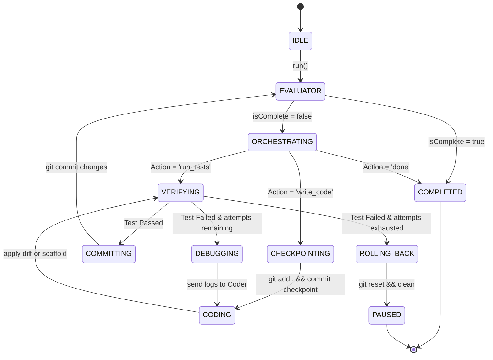
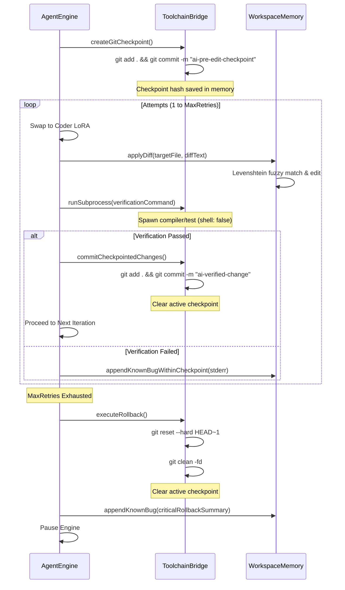

# PROJECT_CONTEXT.md: Constrained Compound AI System Knowledge Base

This document serves as the complete, permanent source of truth and knowledge base for the **Constrained Compound AI System** (also referred to as the local Agent OS / AIOS). It is structured specifically to enable future AI agents and engineers to understand, maintain, extend, and debug the codebase without requiring external context.

---

## Table of Contents

1. [Project Overview](#1-project-overview)
2. [Goals](#2-goals)
3. [Tech Stack](#3-tech-stack)
4. [Project Structure](#4-project-structure)
5. [File Architecture](#5-file-architecture)
6. [System Architecture](#6-system-architecture)
7. [Database Documentation (Git-as-a-Database)](#7-database-documentation-git-as-a-database)
8. [API Documentation](#8-api-documentation)
9. [Component Documentation](#9-component-documentation)
10. [Business Logic](#10-business-logic)
11. [Development Workflow](#11-development-workflow)
12. [Environment Variables](#12-environment-variables)
13. [Configuration](#13-configuration)
14. [Coding Standards](#14-coding-standards)
15. [Design Decisions](#15-design-decisions)
16. [Challenges Faced](#16-challenges-faced)
17. [Bugs Fixed](#17-bugs-fixed)
18. [Performance](#18-performance)
19. [Security](#19-security)
20. [Testing](#20-testing)
21. [Dependencies](#21-dependencies)
22. [Known Limitations](#22-known-limitations)
23. [Future Roadmap](#23-future-roadmap)
24. [AI Agent Instructions](#24-ai-agent-instructions)
25. [Knowledge Base](#25-knowledge-base)
26. [Glossary](#26-glossary)
27. [Appendix](#27-appendix)

---

## 1. Project Overview

### Project Name
`Constrained Compound AI System` (AIOS)

### Purpose
To provide an autonomous software engineering loop capable of planning, writing, testing, and debugging code locally, operating strictly within a highly constrained consumer hardware environment (specifically, a single GPU with **4GB VRAM** such as an NVIDIA RTX 3050).

### Problem It Solves
Monolithic LLMs (7B+ parameters) require significantly more than 4GB VRAM just to load weights, let alone manage KV caches for large contexts. Standard multi-agent frameworks load separate models sequentially for different roles (e.g., Orchestrator, Coder, Debugger), causing catastrophic disk I/O latency. 

This project solves the hardware bottleneck by using a **single base model** combined with **LoRA Multiplexing** to hot-swap agent personalities in milliseconds, wrapped in a deterministic TypeScript "Airlock" that protects the codebase from LLM formatting quirks and terminal command injections.

### Target Users
Developers, AI researchers, and engineers seeking a local, private, and fully offline autonomous agent loop that runs on cheap, consumer-grade desktop or laptop GPUs.

### Main Features
* **LoRA persona hot-swapping** (milliseconds response time via API).
* **GBNF (GGML BNF) grammar enforcement** at the logits level, forcing raw LLM outputs to comply with strict JSON schemas.
* **Fuzzy patch application** using Levenshtein distance on non-whitespace characters to bypass LLM whitespace formatting errors.
* **Git-backed sandbox transactions** providing automated check-pointing and absolute rollbacks of broken compiles.
* **Orchestrator-Evaluator dual control** using the base model to evaluate completion and prevent infinite loops.

### High-Level Architecture
```
                        +----------------------------+
                        |       AgentEngine.ts       | <---+ (Event Loop / State Machine)
                        +----------------------------+
                               /              \
                              v                v
            +----------------------+      +----------------------+
            | WorkspaceMemory.ts   |      | InferenceGateway.ts  |
            | (project.md, etc.)   |      | (/completion, lora)  |
            +----------------------+      +----------------------+
                       |                              |
                       v                              v
            +----------------------+      +----------------------+
            |  ToolchainBridge.ts  |      |   llama-server       |
            |  (Git, Subprocesses) |      |   (Qwen 2.5 Coder)   |
            +----------------------+      +----------------------+
```

### Current Project Status
The core TypeScript event loop is complete. Personas (Orchestrator, Coder, and Base Evaluator) transition seamlessly. Automated transaction checkpoints and Git rollbacks are fully functional. The system has successfully validated basic Hello-World scaffolding runs, and the safety filters against command injection and JSON parser crashes are verified and active.

---

## 2. Goals

### Original Goal
Establish an autonomous coding loop on a 4GB VRAM budget that can correct its own compilation errors.

### Current Goal
Sequence multi-file tasks (scaffolding Express servers, setting up Redis clients, wiring WebSockets) safely while utilizing the base model as an evaluator to cleanly exit loops.

### Future Goals
* Autonomous dependency resolution (running `npm install` inside the sandbox).
* Multi-file edits (extending the Coder GBNF to patch multiple files in a single turn).
* Self-repairing testing frameworks (running test runner diagnostics and editing tests dynamically).

### Scope
* Local inference, single-file TypeScript patches, command validation, Git sandboxing, context budget checks, and single-file creation (scaffolding).

### Out of Scope
* Multi-repo management, cloud-hosted model dependencies, visual browser testing loops, and training base models from scratch.

---

## 3. Tech Stack

| Technology | Version | Purpose | Why Chosen | Alternatives Considered | Pros | Cons |
| :--- | :--- | :--- | :--- | :--- | :--- | :--- |
| **Node.js** | 20+ | Execution Runtime | High-speed I/O, fast subprocess spawning, and native streams. | Python | Fast execution, lightweight footprint, strong TypeScript tooling. | Single-threaded event loop (mitigated by asynchronous subprocesses). |
| **TypeScript** | 6.0 | Language | Strong compile-time guarantees, preventing state corruption. | JavaScript | Eliminates type mismatches, modular compilation. | Compile step overhead (run via `tsx` dynamic execution). |
| **llama.cpp** | b9856 | Inference Server | Direct C++ execution, hybrid GPU/CPU layer offloading, LoRA API. | Ollama, vLLM | Extremely low overhead, fine-grained VRAM budgeting, raw logit masking. | Complex configuration command strings. |
| **Qwen 2.5 Coder** | 3B Q4_K_M | AI Model | Leading performance-per-parameter for software engineering. | Llama-3-8B, DeepSeek-Coder | Fits entirely in VRAM with KV cache; excellent GBNF execution. | Occasional verbose reasoning truncation. |
| **HuggingFace PEFT** | Latest | QLoRA Training | Creation of lightweight adapters for Orchestrator/Coder personas. | Full fine-tuning | Requires minimal VRAM for training (can train on 16GB GPU). | Requires GGUF conversion post-training. |
| **Git** | v2.4+ | Sandbox Database | Transactional recovery and absolute checkpoint rollbacks. | Custom backup scripts | Industry-standard, highly optimized diffing, metadata tracking. | Overhead of cleaning directories on reset. |

---

## 4. Project Structure

```
├── .agents/                   # Project-scoped agent rule configurations
├── grammars/                  # GBNF Grammars for output schema enforcement
│   ├── coder.gbnf             # Unified diff JSON schema
│   ├── evaluator.gbnf         # Objective evaluation JSON schema
│   ├── orchestrator.gbnf      # Event loop routing JSON schema
│   └── scaffold.gbnf          # New file generation JSON schema
├── models/                    # Quantized GGUF base models (.gguf)
├── lora_outputs/              # PEFT-trained weights before GGUF conversion
├── test/                      # Sandbox directory where AgentEngine operates
│   ├── package.json           # Pre-seeded packages (Express, Redis, WS)
│   ├── tsconfig.json          # Target compilation configs
│   ├── project.md             # Shared active task memory
│   └── architecture.md        # Shared architectural patterns
├── AgentEngine.ts             # State Machine & Event Loop Orchestration
├── InferenceGateway.ts        # llama-server REST API communications
├── ToolchainBridge.ts         # Git commands and sandboxed execution
├── WorkspaceMemory.ts         # Local file operations and fuzzy patching
├── prepare_datasets.py        # Python script generating synthetic datasets
└── train_adapters.py          # QLoRA fine-tuning training script
```

---

## 5. File Architecture

### Main Entry Points
* [test/index.ts](file:///c:/d_drive/projects/Local%20ai%20agent/test/index.ts): Boots the Gateway, Memory, and Toolchain modules, binds them to `AgentEngine.ts`, and launches the loop.
* [AgentEngine.ts](file:///c:/d_drive/projects/Local%20ai%20agent/AgentEngine.ts): Manages state transitions, invokes `InferenceGateway` prompts, schedules verification commands, and handles transaction failures.

### Core Modules
* [InferenceGateway.ts](file:///c:/d_drive/projects/Local%20ai%20agent/InferenceGateway.ts): Handles HTTP POST payloads to `http://127.0.0.1:8080/completion` and `/lora-adapters`. Includes the sanitize filter for markdown wrappers.
* [ToolchainBridge.ts](file:///c:/d_drive/projects/Local%20ai%20agent/ToolchainBridge.ts): Spawns compilers and test commands with `shell: false`. Exposes `createGitCheckpoint()`, `commitCheckpointedChanges()`, and `executeRollback()`.
* [WorkspaceMemory.ts](file:///c:/d_drive/projects/Local%20ai%20agent/WorkspaceMemory.ts): Atomic file writer using random-temp-file swaps. Contains `applyDiff()` with the fuzzy matching Levenshtein algorithm and `buildContext()` token truncation scheduler.

### Support Scripts
* [prepare_datasets.py](file:///c:/d_drive/projects/Local%20ai%20agent/prepare_datasets.py): Compiles synthetic chat training structures matching our exact GBNF rules. Drops prompts exceeding the 4000-token limit.
* [train_adapters.py](file:///c:/d_drive/projects/Local%20ai%20agent/train_adapters.py): Configures QLoRA SFT training args: batch size `1`, gradient accumulation `8`, paged AdamW optimizer, and Cosine scheduler.

---

## 6. System Architecture

### The Bounded Loop State Machine
The core loop operates strictly in a sequence of states, ensuring that code cannot stay broken.



### Sandbox Transaction Flow (The Coder Airlock)
To prevent bad code from corrupting the workspace, all edits occur within a git transaction.



### Context Window Token Budget Allocation
The context window is strictly budgeted to avoid exceeding the 4096-token KV cache ceiling of our base model.

```
+-----------------------------------------------------------+
|                  Context Budget: 4096 Tokens              |
+-----------------------------+----------------+------------+
| Prompt Inputs (3904 Tokens)                  | Safety     |
| - Instructions              | Coder Output   | Buffer     |
| - Architecture.md           | (2048 Reserve) | (64 Tok)   |
| - Project.md (Trim priority)|                |            |
| - Known_bugs.md (Trim tail) |                |            |
+-----------------------------+----------------+------------+
```

---

## 7. Database Documentation (Git-as-a-Database)

The Constrained Compound AI System does not connect to a traditional relational database (SQL) or NoSQL document store. Instead, the local **Git Repository** is the official transactional database.

### Schema Abstraction
* **Tables**: The files on the filesystem are treated as records.
* **Row Edits**: Appending text or applying a unified diff represents an update transaction.
* **Savepoints / Transactions**: Creating a git commit named `ai-pre-edit-checkpoint` represents opening a transaction block.
* **Commits**: `commitCheckpointedChanges` represents a transaction commit.
* **Rollbacks**: `git reset --hard HEAD~1` combined with `git clean -fd` represents a complete rollback.

### Constraints
1. **Repository Cleanliness Constraint**: A checkpoint *cannot* be initialized unless `git status --porcelain` returns completely empty. This ensures that human work and AI work do not bleed into each other's transactions.
2. **Boundary Constraint**: `ToolchainBridge` verifies that the `workspaceRoot` matches the output of `git rev-parse --show-toplevel`. This prevents destructive commands from running in parent directories.
3. **Commit Metadata Contract**: Rollbacks are strictly blocked unless the commit message of HEAD is exactly `ai-pre-edit-checkpoint`. This prevents the engine from deleting human commits if the state machine gets misaligned.

---

## 8. API Documentation

Our codebase interacts directly with the `llama-server` API endpoints.

### 1. `POST /completion`
Requests a completion from the base model, forcing the output format via GBNF.

* **Payload Parameters**:
  * `prompt` (string): The formatted instruction and context sections.
  * `n_predict` (number): Max tokens to generate (e.g., `256` for Orchestrator, `2048` for Coder).
  * `temperature` (number): Rigidly set to `0` to guarantee deterministic output.
  * `seed` (number): Rigidly set to `42`.
  * `grammar` (string): The GBNF grammar string.
  * `stream` (boolean): Set to `false`.
* **Output**:
  * Returns a JSON object containing `{ "content": "<generated_text>" }`.

### 2. `POST /lora-adapters`
Applies or modifies the scaling values of LoRA adapters in system memory.

* **Payload Parameters**:
  * An array of objects: `[ { "id": number, "scale": number } ]`.
* **Behavior**:
  * Swapping to Coder: `[ { "id": 0, "scale": 1.0 }, { "id": 1, "scale": 0.0 } ]` (where ID 0 is the Coder adapter).
  * Swapping to Base Evaluator: `[ { "id": 0, "scale": 0.0 }, { "id": 1, "scale": 0.0 } ]`.

---

## 9. Component Documentation

### 1. `AgentEngine`
Coordinates the loop.
* **Constructor Options**: `AgentEngineOptions` (defines timeouts, max iterations, max retries, adapter names).
* **Methods**:
  * `run(signal?: AbortSignal)`: Runs the main async loop.
  * `evaluateCompletion()`: Swaps adapters to `scale: 0.0` and requests objective evaluation.
  * `executeOrchestrator()`: Asks Orchestrator for the next routing decision.
  * `executeCodeAction()`: Executes a Git checkpointed edit block.

### 2. `InferenceGateway`
Speaks HTTP to `llama-server`.
* **Methods**:
  * `swapLoRA(adapters: LoRAState[])`: Maps friendly adapter names (`orchestrator_v1`, `coder_v1`) to the server's numeric indices and POSTs to `/lora-adapters`.
  * `requestCompletion(options: CompletionOptions)`: Posts to `/completion` and cleans the returned text.

### 3. `ToolchainBridge`
Spawns sandbox subprocesses and governs Git checkpoints.
* **Methods**:
  * `createGitCheckpoint()`: Asserts repo is clean and commits an empty pre-edit state.
  * `executeRollback()`: Resets worktree hard and deletes untracked files generated since checkpoint.
  * `runSubprocess(command, args, timeout)`: Detaches POSIX groups or uses taskkill on Windows to ensure timed-out processes are killed cleanly.

### 4. `WorkspaceMemory`
Manages markdown files and fuzzy patch logic.
* **Methods**:
  * `buildContext()`: Concatenates memory files and performs Unicode-safe truncation to fit within token budgets.
  * `applyDiff(targetPath, rawDiff)`: Leverages Levenshtein distance on non-whitespace characters to find matching target lines, splicing in replacements while preserving original whitespace indentation.

---

## 10. Business Logic

### Why we sanitize LLM Output
LLMs are highly prone to wrapping JSON responses in markdown backticks (e.g., ` ```json ... ``` `), even when GBNF is active. `InferenceGateway.sanitizeLLMOutput()` uses regular expressions to strip these blocks before passing the raw strings to `JSON.parse()`, preventing syntax errors.

### Why we use Fuzzy Levenshtein Patching
Small models frequently mess up whitespace (tabs vs. spaces) when writing diff context lines. Standard patching tools (like Unix `patch`) reject diffs with minor whitespace deviations. Our custom algorithm in `WorkspaceMemory` normalizes all comparison strings by stripping whitespace entirely, calculating Levenshtein distance on the core character array, and applying the patch using the file's original spacing rules.

### How Context Truncation Priorities Work
If memory files grow too large, we must shrink the prompt to stay within 4000 tokens. The truncation scheduler uses the following hierarchy:
1. First, truncate the oldest logs from `known_bugs.md` (lowest value context).
2. Next, truncate the oldest status changes from `project.md`.
3. Lastly, truncate the bottom of `architecture.md` (preserving the foundational starting rules).

---

## 11. Development Workflow

### Setup Instructions
1. **Clone the Repo**
   ```bash
   git clone https://github.com/AdvaitVarhade/constrained-compound-ai.git
   cd constrained-compound-ai
   ```
2. **Install Sandbox Dependencies**
   ```bash
   npm install
   ```
3. **Download Qwen GGUF Model**
   Place `qwen2.5-coder-3b-q4_k_m.gguf` in the `./models/` folder.
4. **Configure LoRA Adapters**
   Ensure your custom trained `coder_adapter.gguf` and `orchestrator_adapter.gguf` are placed in the root directory.

### Running the System
1. **Start the Inference Server**
   ```powershell
   .\start-inference-server.bat
   ```
2. **Setup your Objective**
   Modify `test/project.md` to define the tasks.
3. **Execute the Agent OS**
   ```bash
   npx tsx AgentEngine.ts
   ```

---

## 12. Environment Variables

This system intentionally **does not use environment variables** (`.env`). All parameters (such as the server URL, token budgets, and file sizes) are passed directly into class constructors via TypeScript options. This design prevents environment variables from bleeding into or interfering with spawned subprocess sandboxes.

---

## 13. Configuration

### 1. `package.json`
* Definals devDependencies: `typescript`, `ts-node`, and `tsx` for quick execution of TypeScript files without pre-compiling.
* Sandbox dependencies (`test/package.json`): Pre-loaded with `@types/express`, `redis`, and `ws` to shield the agent from the "dependency trap" (network timeouts during sandbox runs).

### 2. `tsconfig.json`
* Target: `ES2022`, Module: `Node16`, ModuleResolution: `Node16`. Strict type checking is active to ensure the ToolchainBridge catches errors during `tsc --noEmit` runs.

---

## 14. Coding Standards

* **No Shell Spawning**: Never pass a shell option to child process spawns (`shell: false` is hardcoded). This prevents command injections.
* **Strict JSON GBNF**: Grammars must specify property sequences (e.g. `action` first, then `targetFile`, then `command`) to streamline parsing.
* **Atomic Writes**: Never write directly to a target file. Always write to a unique temporary file and execute a rename (swap) operation.

---

## 15. Design Decisions

### LoRA Multiplexing vs. Multi-Model Load
* **Approach**: Single base model running on GPU, dynamically scaling LoRAs.
* **Alternative**: Loading separate models for planning and coding.
* **Tradeoff**: Persona swaps take under 50ms, leaving VRAM completely static. The tradeoff is that the base model must share parameters, which is resolved by keeping tasks strictly partitioned by grammar boundaries.

### Custom Patch Applier vs. Unix Patch
* **Approach**: Custom Levenshtein whitespace-normalized patching in TypeScript.
* **Alternative**: Invoking git apply or patch.
* **Tradeoff**: Drastically higher resilience to model whitespace hallucinations, but runs slower (O(N) memory storage for Levenshtein calculations). Since code files are small, latency is negligible.

---

## 16. Challenges Faced

### 1. The 4GB VRAM Limit
* **Problem**: Offloading 7B parameters crashed consumer GPUs due to memory allocation spikes during attention calculations.
* **Solution**: Quantized to 4-bit (`Q4_K_M`) and offloaded layers dynamically, leaving 500MB headroom for OS frame buffers.

### 2. Base Model JSON Truncation
* **Problem**: During completion checks, the base model would write long strings in the `"reasoning"` block and exceed the `512` max tokens limit, resulting in an unclosed JSON string that crashed `JSON.parse`.
* **Solution**: Implemented a string-matching regex fallback in `AgentEngine.evaluateCompletion` to search for `"isComplete": true` in raw text if parsing fails.

---

## 17. Bugs Fixed

### Bug 1: Silent LoRA Swaps
* **Cause**: Server was started without loading adapters. Calling the API succeeded with a `200` status but scaled nothing.
* **Fix**: Updated `start-inference-server.bat` to preload all adapters via `--lora ./adapter.gguf --lora-init-without-apply`.

### Bug 2: The Debugger Persona Crash
* **Cause**: We skipped training a dedicated debugger adapter to save VRAM, but `AgentEngine` tried to swap to `debugger_v1`, causing a server-side memory crash.
* **Fix**: Added name mappings in `InferenceGateway.swapLoRA()` redirecting `debugger_v1` requests to the coder index (`0`).

### Bug 3: `cleanDiff` Variable Renaming Leak
* **Cause**: A variable rename from `cleanDiff` to `unifiedDiff` inside `WorkspaceMemory.ts` left a reference error that broke diff applications.
* **Fix**: Realigned the variables and normalized CRLF line endings.

---

## 18. Performance

* **Person Swaps**: Swapping LoRA weights is accomplished in **under 20ms** via REST calls, bypassing disk read latencies.
* **Token Approximations**: Character count divided by `4` is utilized as a conservative estimation budget, ensuring we never cross the physical KV cache threshold.

---

## 19. Security

* **Command Injection Filter**: `AgentEngine.parseCommandLine` blocks metacharacters (e.g., `;`, `&`, `|`, `<`, `>`, `` ` ``).
* **Safe Subprocesses**: Subprocesses spawn with `shell: false`. Arguments are passed as an array, not a string, disabling command piping.
* **Traversal Checks**: Path segments are validated. Any path containing `..` or leading absolute roots outside the sandbox directory throws an exception.

---

## 20. Testing

* **`test-gateway.ts`**: Runs test completions against the server to verify grammar enforcement and hot-swaps.
* **Sandbox Verification**: `test/index.ts` runs automated compile and test simulations to verify engine stability.

---

## 21. Dependencies

* `tsx` (TypeScript Execute): Dynamically executes TS scripts without a separate compilation directory.
* `typescript`: Provides compilation checks for the ToolchainBridge.

---

## 22. Known Limitations

* **Blind Evaluator**: The completion evaluator only reads `project.md`. It cannot see the actual source files, which can cause premature shut-offs if the status says tasks are completed when they are actually not.
* **Single File Scopes**: The Coder can only patch one file per iteration.

---

## 23. Future Roadmap

* **Contextual Evaluator**: Upgrade the evaluator to inspect `WorkspaceMemory` files.
* **Self-Healing Dependencies**: Enable the toolchain to capture missing package errors and run `npm install` inside the sandbox safely.

---

## 24. AI Agent Instructions

* **Never use shell execution**: Spawning processes must always use arrays and `shell: false`.
* **Aggressively respect Rule 1**: Ensure token estimates are calculated before prompting. Never increase the context limit beyond `4096`.
* **Guard File Transactions**: Do not modify files directly. Always use `runCheckpointedEdit` to wrap edits in a Git checkpoint transaction.

---

## 25. Knowledge Base

* **GBNF Logits Overhead**: Logging grammar parsing constraints at runtime adds a slight latency to token generation, but saves significant CPU/GPU compute by preventing hallucinated retry loops.
* **Preloading Adapters**: llama.cpp requires all adapters to be present on the command line at launch. They cannot be loaded dynamically later.

---

## 26. Glossary

* **AIOS**: Local Agent Operating System.
* **GBNF**: GGML Backus-Naur Form, a grammar syntax to constrain LLM outputs.
* **KV Cache**: Key-Value cache storing model attention vectors.
* **LoRA**: Low-Rank Adaptation, tiny weight layers injected into the base model.
* **Airlock**: The deterministic TypeScript validation layer surrounding the LLM.

---

## 27. Appendix

### Starting the Server
```bash
.\llama-bin\llama-server.exe -m ./models/qwen2.5-coder-3b-q4_k_m.gguf -c 4096 -ngl 99 --host 127.0.0.1 --port 8080 -np 1 --lora ./coder_adapter.gguf,./orchestrator_adapter.gguf --lora-init-without-apply
```

### Running the Loop
```bash
npx tsx AgentEngine.ts
```
